# DeclineDoctor Incident State Machine 🔄

DeclineDoctor implements an authoritative, validated directed graph state machine.
All state transitions are validated in `backend/app/policy.py` at the service boundary.
Terminal states are strictly immutable; once an incident reaches a terminal state, automated re-execution is forbidden.

---

## State Diagram

```mermaid
graph TD
    AD[ANOMALY_DETECTED] -->|Diagnose| DIAG[DIAGNOSED]
    AD -->|Confidence < 0.70| ELC[ESCALATED_LOW_CONFIDENCE]

    DIAG -->|Confidence < 0.70| ELC
    DIAG -->|Revenue < ₹50,000| ELR[ESCALATED_LOW_REVENUE]
    DIAG -->|Revenue > ₹500,000 & Unapproved| AHA[AWAITING_HUMAN_APPROVAL]
    DIAG -->|Safe to Execute| AS[ACTION_SELECTED]

    AHA -->|Authorized Human Approval| AS
    AHA -->|Revenue < ₹50,000| ELR

    AS -->|Simulate Recovery| AA[ACTION_APPLIED]
    AA -->|Improvement >= 5.0 pp| RES[RESOLVED]
    AA -->|Improvement < 5.0 pp| EIR[ESCALATED_INSUFFICIENT_RECOVERY]
    
    RES -->|Operator Rollback| RB[ROLLED_BACK]
    AA -->|Operator Rollback| RB

    classDef terminal fill:#331111,stroke:#e11d48,stroke-width:2px;
    classDef active fill:#112233,stroke:#3b82f6,stroke-width:2px;
    classDef resolved fill:#113322,stroke:#10b981,stroke-width:2px;

    class ELC,ELR,EIR,RB terminal;
    class AD,DIAG,AHA,AS,AA active;
    class RES resolved;
```

---

## States & Definitions

### Active States
| State | Description | Allowed Next States |
| :--- | :--- | :--- |
| `ANOMALY_DETECTED` | Success rate drop > 20 pp and Z-score significance threshold crossed. | `DIAGNOSED`, `ESCALATED_LOW_CONFIDENCE` |
| `DIAGNOSED` | Root-cause hypothesis classified and confidence calculated. | `AWAITING_HUMAN_APPROVAL`, `ACTION_SELECTED`, `ESCALATED_LOW_CONFIDENCE`, `ESCALATED_LOW_REVENUE` |
| `AWAITING_HUMAN_APPROVAL` | High-value exposure (> ₹500,000). Automated execution held pending dual control. | `ACTION_SELECTED`, `ESCALATED_LOW_REVENUE` |
| `ACTION_SELECTED` | Compatible mitigation strategy selected and validated by backend policy. | `ACTION_APPLIED`, `RESOLVED`, `ESCALATED_INSUFFICIENT_RECOVERY` |
| `ACTION_APPLIED` | Bounded retries simulated with max 2 retries per transaction. | `RESOLVED`, `ESCALATED_INSUFFICIENT_RECOVERY`, `ROLLED_BACK` |

### Terminal States (Strictly Immutable)
| State | Description | Next Steps / Operator Actions |
| :--- | :--- | :--- |
| `RESOLVED` | Post-intervention success rate improvement >= 5.0 percentage points. | Terminal state. Can only be transitioned to `ROLLED_BACK` if operator triggers rollback. |
| `ESCALATED_LOW_CONFIDENCE` | Diagnostic confidence < 0.70. Automated intervention blocked to prevent routing errors. | Terminal state. Escalated to payments engineering queue for manual investigation. |
| `ESCALATED_LOW_REVENUE` | At-risk exposure < ₹50,000. Automated actions suppressed to avoid operational churn. | Terminal state. Added to batch settlement review. |
| `ESCALATED_INSUFFICIENT_RECOVERY` | Simulated recovery produced < 5.0 percentage points improvement. | Terminal state. Halts retries to prevent network penalties or fees. |
| `ROLLED_BACK` | Mitigation was reversed by an authorized operator; original failure states restored. | Terminal state. Incident closed with rollback audit proof. |

---

## State Transition Verification Rules

1. **Terminal Immutability:** Any attempt to trigger recovery on an incident in a terminal state returns HTTP 200 with `{"status": "blocked", "reason": "terminal_incident"}` and logs `RECOVERY_BLOCKED` in the audit log.
2. **Deterministic Dual Control:** Incidents exceeding ₹500,000 cannot enter `ACTION_SELECTED` unless `human_approved=True` AND `user_role in {"ADMIN", "OPERATOR"}`.
3. **No Secondary Automated Retries:** An incident that ends in `ESCALATED_INSUFFICIENT_RECOVERY` cannot be re-executed with an alternative action.
